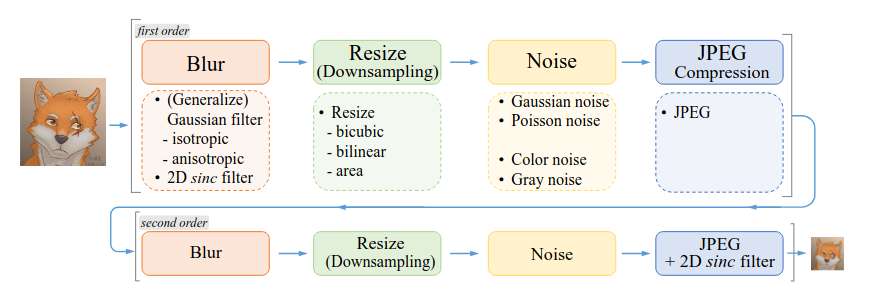
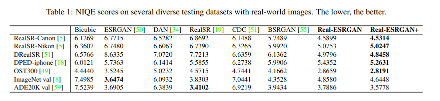
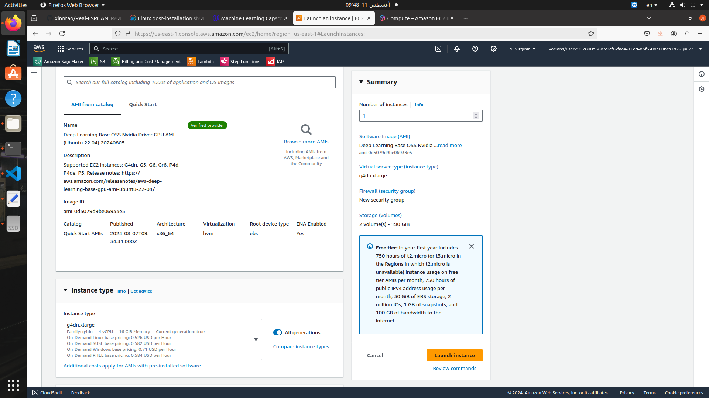
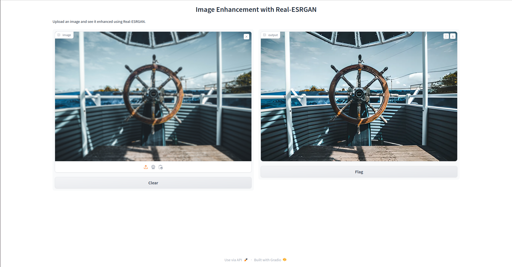
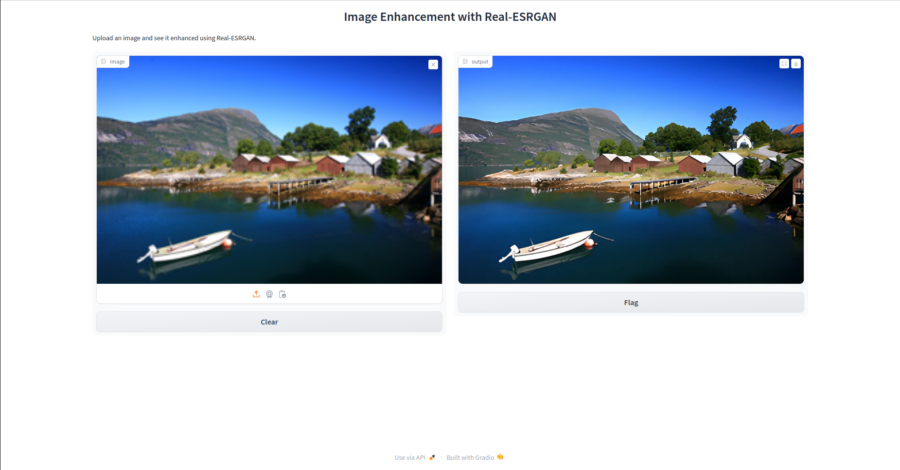

# AWS Machine Learning Engineer Nanodegree
## Capstone Project
Mohamed Hafez  
August 15, 2024

## I. Definition
### Project Overview


This project aims to build a web application for image super-resolution. The project uses the Real-ESRGAN model, and is deployed on Amazon Web Services (AWS). The project uses docker, Uvicorn, FasAPI and gradio to build and deploy the web application. The user can upload a low-resolution image to the web interface, and the app will return the same image upscaled. 

### Problem Statement

Traditional image upscaling methods like bicubic interpolation often result in blurry and low-quality upscaled images, failing to capture fine details and textures present in high-resolution images. The challenge is to develop an image upscaling application using deep learning that can produce sharp and realistic high-resolution images from low-resolution inputs. Deep learning applications often require high-end expensive hardware that is not available for anyone. Therefore, this app is deployed on AWS and the process of deployment is thoroughly discussed, allowing anyone to build such application without necessarily owning dedicated hardware. 

### Metrics

Existing metrics for perceptual quality cannot accurately reflect human preference on the fine-grained scale. However, the authors provide quantitative comparisons of Real-ESRGAN against other models using the non-reference image quality assessment (NIQE). I will show the result of the Real-ESRGAN model on NIQE in the benchmark section 

## II. Analysis

### Data Exploration

In this project, the primary focus is on utilizing Real-ESRGAN, a super-resolution image restoration model based on Generative Adversarial Networks (GANs). The input data for this project comprises high-resolution images that serve as the basis for both the training and inference phases of the Real-ESRGAN model.

During the training phase, the model receives high-resolution images as input. These images undergo a process where degradations are applied and downscaled to simulate real-world scenarios. The objective is to train the model to accurately restore the high-resolution details lost during the degradation and downscaling process.

In the inference phase, the model is expected to take low-resolution images as input and upscale them to produce super-resolution images with enhanced quality and finer details.

"The figure below shows the pure synthetic data generation adopted in Real-ESRGAN. It utilizes a second-order degradation
process to model more practical degradations, where each degradation process adopts the classical degradation model. The
detailed choices for blur , resize, noise and JPEG compression are listed." ([original paper](https://arxiv.org/pdf/2107.10833)) 
<p align="center">
  
</p>


### Exploratory Visualization

Below are some sample images from the [DIV2K](https://data.vision.ee.ethz.ch/cvl/DIV2K/) dataset which includes high-resolution images for training and low-resolution images for testing the performance of the model. 

<p align="center">
  
</p>

<p align="center">
  
</p>


### Algorithms and Techniques

In this section, we delve into the algorithms and techniques underpinning the deployment of Real-ESRGAN, a super-resolution image restoration model, on AWS using an Amazon EC2 instance. Below is a list of used models, frameworks, and services to deploy Real-ESRGAN on AWS. 

- **Real-ESRGAN Model** : Real-ESRGAN aims at developing practical algorithms for general image/video restoration. It extends the powerful ESRGAN to a practical restoration application, namely, Real-ESRGAN. Real-ESRGAN can deal with various degradation effects like unknown blurs, complicated noises and common compression artifacts. The real degradations usually come from complicated combinations of different degradation processes such as the imaging system of cameras, image editing, and internet transmission. This motivated the authors to extend the classical first-order degradation model to high-order degradation modeling for real-world degradation. As for the network architecture, Real-ESRGAN adopts the same generator network as that in ESRGAN. For the scale factor of ×2 and ×1, it first employs a pixel-unshuffle operation to reduce spatial size and re-arrange information to the channel dimension. The figure below is from the original paper, it shows the generator architecture of the Rea-ESRGAN model. 
<p align="center">
  
</p>


- **Amazon EC2 instance** : This is the main AWS service I am going to use. Amazon Elastic Compute Cloud (Amazon EC2) provides on-demand, scalable computing capacity in the Amazon Web Services (AWS) cloud as explained in the [AWS docs](https://docs.aws.amazon.com/AWSEC2/latest/UserGuide/concepts.html). 
- **Docker** : I used [Docker](https://www.docker.com/) as a containerization framework to easily deploy and launch my application in AWS. 
- **FastAPI** : [FastAPI](https://fastapi.tiangolo.com/) is used as a web-framework. FastAPI is a modern, fast (high-performance), web framework for building APIs with Python based on standard Python type hints ([docs](https://fastapi.tiangolo.com/)). 
- **Uvicorn** : [Uvicorn](https://www.uvicorn.org/) is used as an ASGI web server. 
- **Gradio** : Gradio is used to build user-interface to interact with the application. 


### Benchmark

The following table is taken from the original paper. Though the Real-ESRGAN+ does not optimize for NIQE scores, it sill produces lower NIQE scores on most testing datasets.
<p align="center">
  
</p>

However, as previousely mentioned, the quantitive measures do not accurately reflect human perception in fine-grained details. Therefore, I am going to show some qualitative results of images restored by the Real-ESRGAN model
<p align="center">
  
</p>


## III. Methodology

### Data Preprocessing

In this section, we delve deeper into the classical degradation model by providing detailed explanations for each degradation type utilized, as exaplained by the authors in the original paper.      


#### Blur

Blur is a critical aspect of the classical degradation model. Commonly, isotropic and anisotropic Gaussian filters are employed as blur kernels to simulate image blurring. To introduce a broader spectrum of kernel shapes, we incorporate generalized Gaussian blur kernels and a plateau-shaped distribution. Empirical observations reveal that these blur kernels enhance the sharpness of outputs for real-world samples.    


#### Noise

Noise plays a significant role in image degradation. Additive Gaussian noise and Poisson noise are two prevalent types of noise introduced in the classical model. Poisson noise exhibits intensity proportional to the image intensity, with noise at different pixels being independent.    


#### Resize

Resizing operations are fundamental in image processing. Several resize algorithms, including nearest-neighbor interpolation, area resize, bilinear interpolation, and bicubic interpolation, are compared to evaluate their effects on images. By downsampling an image by a factor of four and subsequently upsampling it to its original size, we analyze the outcomes of different resize operations. 


#### JPEG compression
In our preprocessing steps, we focus on JPEG compression using the PyTorch tool - DiffJPEG. Comparing the compressed images from DiffJPEG with those from the cv2 package, we notice slight differences. These distinctions could widen the gap between synthetic and real samples. To simplify our approach, we stick to using DiffJPEG exclusively for now. 


### Implementation

In this section, I will explain in details the implementation steps I used to deploy Real-ESRGAN model on AWS. 

#### Adapt Real-ESRGAN code to accept http requests  
The inference code of Real-ESRGAN needs to be adapted to accept http requests from the web application. To achieve this, I used FastAPI as a web framework and Uvicorn as an ASGI server. The main modifications are the following: 

- Call the FastAPI class and instantiate an app from it 

```python
from fastapi import FastAPI
app = FastAPI()
```
- Use the app instance to define endpoints for your application, note the request type and the endpoint path. 

```python
@app.get("/")
def read_root():
	return {"Hello": "World"}

@app.post("/inference")
def inference(item: data):
	result = main(item.img_str, tile=item.tile)
	
	return result

```
- To pass arguemnts to one of your endpoints, you can use pydantic to define a class that inherets from the BaseModel class. Any method you define for this class can be passed in the request body as json key-value pairs

```python
from pydantic import BaseModel

class data(BaseModel):
	img_str: str
	tile: int = 0
	half: bool = False
	output_dir: str = "results"
```


Here is the full main.py script: 

```python
from fastapi import FastAPI
from inference_realesrgan_aws import main
from pydantic import BaseModel


class data(BaseModel):
	img_str: str
	tile: int = 0
	half: bool = False
	output_dir: str = "results"


app = FastAPI()

@app.get("/")
def read_root():
	return {"Hello": "World"}


@app.post("/inference")
def inference(item: data):
	result = main(item.img_str, tile=item.tile)
	
	return result
```

Another point you need to consider is how to send and recieve data. There are several different ways to do this, but I used simple base64 encoding for the image to send it as a string. The functions below are from inference_realesrgan_aws.py script to encode and decode the data

```python
def input_fn(img_str):
    """
    Deserialize and prepare the prediction input
    """

    data = base64.b64decode(img_str, validate= True)

    im = Image.open(BytesIO(data))
    np_image = np.array(im)
    # im.save('image1.png', 'PNG') # Optionally save the image 

    return np_image


def prepare_image(frame, encode_quality = 50): 
    frame = cv2.cvtColor(frame,cv2.COLOR_RGB2BGR)
    _,buffer = cv2.imencode('.png', frame, [cv2.IMWRITE_JPEG_QUALITY, encode_quality])
    dashboard_img = base64.b64encode(buffer).decode()
    return dashboard_img
```


You need to update the main function in your Real-ESRGAN inference script to accept your arguments. This is trivial, so I am not going to discuss it here, but the code is available in inference_realesrgan_aws.py script. 


#### Create a sample function to send http requests 
You need to create a scirpt to interact with your server using http requests. The script should send low-resolution images with proper arguments and recieve the upscaled image. The code uses the requests library and applies the same encoding and decoding methods in the inference script we discussed earlier, it is available in sample_request.py 

#### Create a web demo using Gradio 
The web UI of the application is created using Gradio. Gradio allows you to quickly build a demo or web application for your machine learning model. The script is available in gradio_demo.py 


#### Create a Docker container for easier deployment 
To easily deploy my application in AWS, I created a Docker container. The Dockerfile used to build the container will take care of installing all the needed dependencies. You can take a look at the Dockerfile for more details. To build the container, use the following command in the project directory. 
```bash
docker build -t real_esrgan .  
```
You can optionally push the container to your repository in [Docker Hub](https://hub.docker.com/) to pull it later in AWS. 

#### Run EC2 instance with GPU capabilities
Now, we finally get to work on AWS infrastructure! We will launch an EC2 instance to host both the Real-ESRGAN ASGI server and the gradio demo app. Start by navigating to the EC2 dashboard in your AWS account 
<p align="center">
  
</p>

Then select **Launch Inastance** from the top right corner, this will open a page to configure settings for your instance. 

##### Amazon Machine Image (AMI) and instance type
Select an AMI that supports deep learning applications, to make our life easier as it will have all the required software to build deep learning applications. Moreover, you need to select an instanced type that supports accelerated computing using Nvidia GPUs. This way, we can leverage the parallel computing of GPUs using pytorch with cuda which will significantly affect the latency of our application. One example of an AMI and instance type is shown below. 
<p align="center">
  
</p>

##### Key pair and netwrok settings
Create a key pair and save it in a safe location. This key pair will be used to connect to your EC2 instance using ssh or putty. Instructions on how to connect are explained the AWS [docs](https://docs.aws.amazon.com/AWSEC2/latest/UserGuide/connect-linux-inst-ssh.html).   
For network settings, it is better to disable http requests as you will not need them for this app (since gradio will take care of creating a proxy server for you). As for ssh, make sure to allow the IP of the computer you will use to access the server. 

You are now ready to launch your insatnce! After you launch it you should be able to connect by ssh on linux or putty in windows using the key pair you exported earlier. 


#### Run your app in EC2 
The final step, and the easiest, is to run your app in the EC2 instance. After connecting to the instance using [ssh](https://docs.aws.amazon.com/AWSEC2/latest/UserGuide/connect-linux-inst-ssh.html) or [putty](https://docs.aws.amazon.com/AWSEC2/latest/UserGuide/connect-linux-inst-from-windows.html), you are ready to pull you docker image into the server. If you already pushed the Docker image to docker hub, you can simply pull using 
```bash
docker pull repo-name/real-esrgan-aws:tag   
```
Alternatively, you can clone this repo and build the image here as we explained earlier.   

After preparing your image, run the container in detach mode using the default entrypoint. This will allow us to use the terminal even after running the container

```bash
docker run -d --network host -it --gpus all repo-name/real-esrgan-aws:tag
```
Now, it is time to run the gradio demo app, for this, we will run the same container but we will override the default entrypoint which will allow us to use the container's terminal. Note that we mounted the current directory (project root) to sync changed files if any. 

```bash
docker run -it --network host --entrypoint /bin/bash -v ./:/app repo-name/real-esrgan-aws 
```

Finally, we run the gradio demo app by using the command below, You can control sharing the demo publicly by using the share parameter (default is False)

```python
python3 gradio_demo.py --share
```
A link will be created which will show this page when accessed
<p align="center">
  
</p>

You can now upload an image and see it upscaled!
<p align="center">
  
</p>


### Refinement

The imrovement I made is mainly in the deployment part. I provided clear steps to succefully deploy Real-ESRGAN as a web application. This included adapting the inference code, writing the docker file, and providing detailed steps on how to deploy in EC2 instance. All steps were explained in the implementation section of this report.


## IV. Results

### Model Evaluation and Validation

I tested the model on various images that have different patterns and textures. Below are some results of the testing. 

<p align="center">
  
</p>

<p align="center">
  
</p>


### Justification


The final product in our case is a web application hosted on AWS. The deployment process is thoroughly discussed and the code are available publicly on GitHub. Hence, any interested developer should be able to replicate the whole process. Moreover, readers get to see an end-to-end solution that uses several technologies which can be used in other scenarios. 
